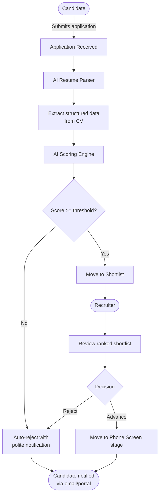
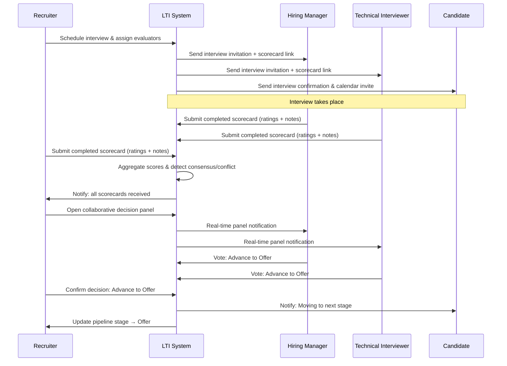
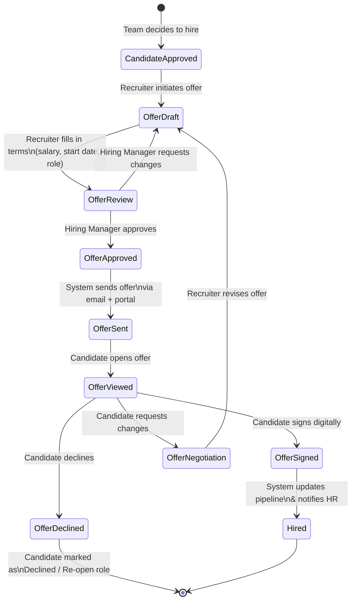
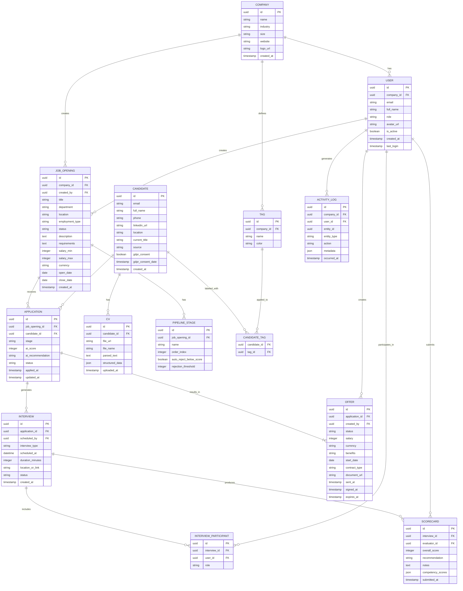
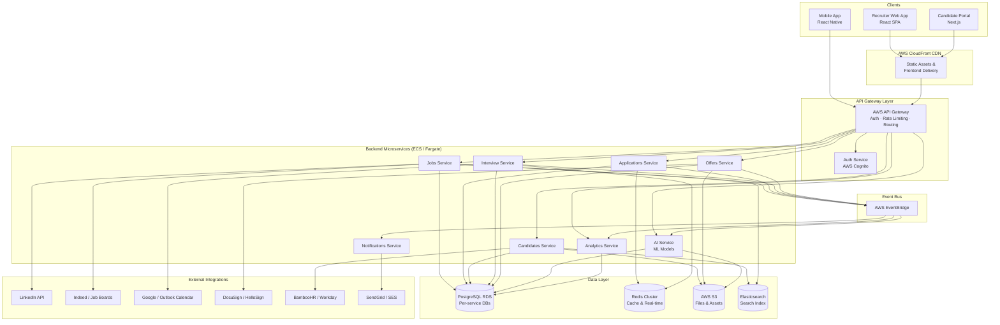
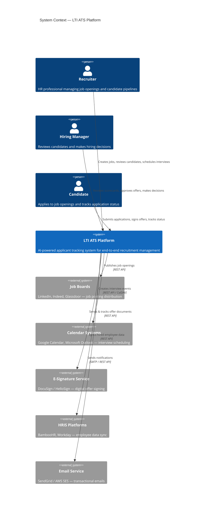
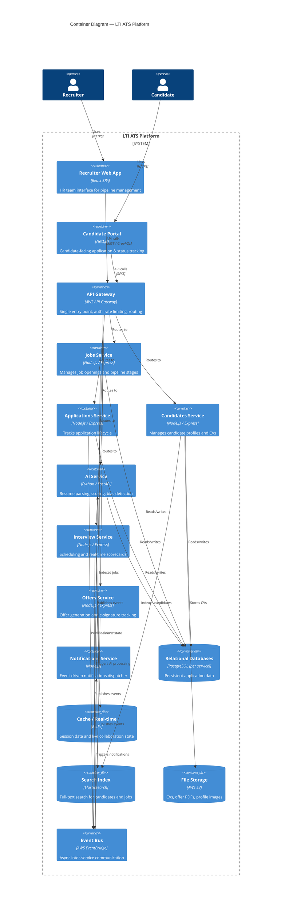
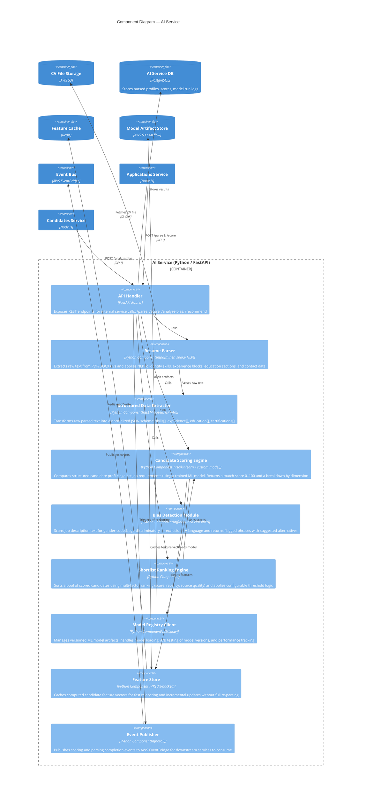

# LTI - ATS System Design

## Table of Contents
1. [Software Description & Business Model](#1-software-description--business-model)
2. [Main Use Cases](#2-main-use-cases)
3. [Data Model](#3-data-model)
4. [High-Level System Design](#4-high-level-system-design)
5. [C4 Diagram](#5-c4-diagram)

---

## 1. Software Description & Business Model

### Brief Description

**LTI (Let's Track It)** is a next-generation Applicant Tracking System (ATS) built for the modern hiring landscape. LTI combines intelligent automation, real-time collaboration, and AI-powered insights to help HR departments and hiring managers attract, evaluate, and hire the best talent — faster and smarter than ever before.

### Added Value & Competitive Advantages

- **AI-assisted screening:** Automatically ranks and filters candidates based on job requirements, reducing time-to-shortlist by up to 70%.
- **Real-time collaboration:** Recruiters and hiring managers can comment, rate, and make decisions on candidates simultaneously, eliminating email chains and delayed feedback.
- **Automated workflows:** Configurable pipeline stages with automated notifications, scheduling, and follow-up actions reduce manual administrative work.
- **Bias reduction tools:** AI flags potentially biased language in job descriptions and anonymizes CV reviews to promote fair hiring.
- **Predictive analytics:** Dashboards surfacing hiring funnel metrics, time-to-hire, source effectiveness, and candidate drop-off insights.
- **Seamless integrations:** Native connectors to LinkedIn, job boards, HRIS platforms (Workday, BambooHR), and calendar systems (Google, Outlook).
- **Candidate experience portal:** A branded, mobile-friendly portal where candidates can track their application status, schedule interviews, and communicate directly with the team.

### Main Features

1. **Job Posting Management** – Create, publish, and manage job openings across multiple channels from a single interface.
2. **Candidate Pipeline** – Visual Kanban-style board to manage candidates across hiring stages (Applied → Screening → Interview → Offer → Hired/Rejected).
3. **AI Resume Parsing & Scoring** – Automatically extract structured data from CVs and score candidates against the job requirements.
4. **Interview Scheduling** – Integrated calendar tool allowing one-click interview scheduling with automatic notifications to all parties.
5. **Collaborative Evaluation** – Scorecards, notes, and star ratings shared in real time among the hiring team.
6. **Offer Management** – Generate, send, and track digital offer letters with e-signature capabilities.
7. **Analytics & Reporting** – Customizable dashboards with KPIs: time-to-hire, cost-per-hire, source quality, diversity metrics.
8. **Compliance & GDPR Tools** – Automated data retention policies, candidate consent management, and audit trails.

---

### Lean Canvas

```mermaid
block-beta
  columns 3

  block:problem["**PROBLEM**\n\n- Fragmented tools (email, spreadsheets, disconnected ATS)\n- Slow screening processes\n- Poor collaboration between HR & managers\n- Bad candidate experience"]:1
  block:solution["**SOLUTION**\n\n- Unified AI-powered ATS\n- Automated screening & scoring\n- Real-time collaboration workspace\n- Candidate self-service portal"]:1
  block:uvp["**UNIQUE VALUE PROPOSITION**\n\nThe ATS that lets recruiters and managers hire smarter together — with AI doing the heavy lifting"]:1

  block:unfair["**UNFAIR ADVANTAGE**\n\n- Proprietary AI scoring model trained on millions of hiring outcomes\n- Real-time collab engine (no page refresh needed)\n- Deep HRIS integrations out of the box"]:1
  block:customer_segments["**CUSTOMER SEGMENTS**\n\n- Mid-size to large companies (50–5000 employees)\n- High-growth startups scaling fast\n- Staffing & recruitment agencies"]:1
  block:channels["**CHANNELS**\n\n- Direct sales (B2B SaaS)\n- LinkedIn & HR events\n- Integration marketplace\n- Referral program"]:1

  block:metrics["**KEY METRICS**\n\n- Time-to-hire reduction\n- Monthly Active Recruiters\n- Candidate NPS\n- Pipeline conversion rate"]:1
  block:cost["**COST STRUCTURE**\n\n- Cloud infrastructure (AWS/GCP)\n- AI model training & inference\n- Sales & marketing\n- Customer success team"]:1
  block:revenue["**REVENUE STREAMS**\n\n- Monthly SaaS subscription (per seat)\n- Enterprise annual contracts\n- Premium add-ons (AI insights, white-label)"]:1
```

> *Note: The Lean Canvas above is rendered as a block diagram. For a traditional Lean Canvas table view, see below.*

| | | |
|---|---|---|
| **Problem** | **Solution** | **Unique Value Proposition** |
| Fragmented tools, slow screening, poor HR-manager collaboration, bad candidate experience | Unified AI-powered ATS, automated screening & scoring, real-time collaboration, candidate self-service portal | "The ATS that lets recruiters and managers hire smarter together — with AI doing the heavy lifting" |
| **Unfair Advantage** | **Customer Segments** | **Channels** |
| Proprietary AI scoring model, real-time collab engine, deep HRIS integrations | Mid-size to large companies, high-growth startups, staffing agencies | Direct B2B sales, LinkedIn, HR events, integration marketplace, referrals |
| **Key Metrics** | **Cost Structure** | **Revenue Streams** |
| Time-to-hire reduction, Monthly Active Recruiters, Candidate NPS, pipeline conversion rate | Cloud infra, AI training/inference, sales & marketing, CS team | Per-seat SaaS subscription, enterprise annual contracts, premium AI add-ons |

---

## 2. Main Use Cases

### Use Case 1: AI-Powered Candidate Screening

**Description:** A recruiter creates a job posting and the system automatically screens incoming applications using AI, scoring and ranking candidates based on skills, experience, and cultural fit indicators — surfacing the top candidates for human review.

**Actors:** Recruiter, AI Screening Engine, Candidate



**Preconditions:**
- A Job Opening has been published in the system.
- The candidate has submitted their application with a CV.

**Main Flow:**
1. Candidate submits an application through the careers portal or job board integration.
2. The AI Resume Parser extracts structured data (skills, experience, education, contact info).
3. The AI Scoring Engine compares the candidate profile against the job requirements and generates a match score (0–100).
4. Candidates above the configured threshold are moved to the "Shortlist" stage; those below receive an automated rejection.
5. The recruiter reviews the ranked shortlist and makes advancement decisions.

**Postconditions:**
- Candidate status is updated in the pipeline.
- Candidate receives an automated notification about their application status.

---

### Use Case 2: Real-Time Collaborative Interview Evaluation

**Description:** After a candidate completes an interview, multiple stakeholders (recruiter, hiring manager, technical interviewer) independently submit structured scorecards. The system aggregates scores and facilitates a team decision in real time.

**Actors:** Recruiter, Hiring Manager, Technical Interviewer, System



**Preconditions:**
- Candidate is in the "Interview" stage.
- At least one interview has been completed.

**Main Flow:**
1. Recruiter schedules the interview and assigns evaluators via the system.
2. All parties receive calendar invites and evaluation scorecards.
3. After the interview, each evaluator independently submits their scorecard (ratings on competencies + free-text notes).
4. The system aggregates scores and notifies the recruiter when all scorecards are submitted.
5. The team convenes in a real-time decision panel to discuss and vote.
6. Once consensus is reached, the pipeline is updated and the candidate is notified.

**Postconditions:**
- Candidate's pipeline stage is updated.
- All scorecards are stored and auditable.
- Candidate is notified of next steps.

---

### Use Case 3: Offer Generation & Digital Signature

**Description:** Once a candidate is approved for hire, the recruiter generates a formal offer letter, customizes the terms, and sends it for digital signature. The system tracks the offer status in real time.

**Actors:** Recruiter, Hiring Manager, Candidate, E-signature Service



**Preconditions:**
- Candidate has reached the "Offer" stage after team approval.
- Offer template has been configured for the relevant job role.

**Main Flow:**
1. Recruiter selects the candidate and initiates offer creation, choosing a pre-built template.
2. Recruiter customizes compensation, start date, and other terms.
3. Hiring Manager reviews and approves the offer within the system.
4. System sends the offer letter to the candidate via email and through the candidate portal.
5. Candidate opens, reviews, and digitally signs the offer.
6. System notifies the recruiter and HR team; pipeline is updated to "Hired".

**Postconditions:**
- Signed offer letter is stored and linked to the candidate record.
- Candidate status is set to "Hired".
- Onboarding workflow can be triggered.

---

## 3. Data Model

### Entity-Relationship Diagram



### Key Entities Summary

| Entity | Description |
|---|---|
| **Company** | Tenant organization using LTI |
| **User** | Recruiter, Hiring Manager, or Admin within a company |
| **Job Opening** | A position to be filled |
| **Candidate** | A person applying for one or more positions |
| **Application** | Link between a candidate and a job opening, with pipeline stage |
| **CV** | Resume file + parsed/structured data |
| **Interview** | A scheduled interview session tied to an application |
| **Interview Participant** | User assigned to attend and evaluate an interview |
| **Scorecard** | Evaluation submitted by an interviewer after an interview |
| **Offer** | Formal job offer tied to an application, with e-signature tracking |
| **Pipeline Stage** | Custom stages defined per job opening |
| **Tag** | Labels for organizing and filtering candidates |
| **Activity Log** | Audit trail of all system actions |

---

## 4. High-Level System Design

### Architecture Overview

LTI is built as a **cloud-native, multi-tenant SaaS application** using a **microservices architecture** deployed on AWS. The system is designed for high availability, horizontal scalability, and data isolation between tenant organizations.

The architecture is organized into the following layers:

**Frontend Layer:** A React-based Single Page Application (SPA) delivered via a CDN (CloudFront). The candidate-facing portal is a separate, lightweight Next.js application to optimize public performance and SEO. Both clients communicate with the backend exclusively through a versioned REST/GraphQL API.

**API Gateway Layer:** AWS API Gateway handles authentication (JWT validation via Cognito), rate limiting, request routing, and SSL termination. All traffic flows through this single entry point.

**Backend Services Layer:** The core business logic is decomposed into independent microservices, each owning its own database:
- **Jobs Service** – manages job openings, pipeline configuration, and multi-board publishing.
- **Applications Service** – tracks application lifecycle and pipeline stage transitions.
- **Candidates Service** – stores and manages candidate profiles and CV data.
- **AI Service** – handles resume parsing, candidate scoring, and bias detection using ML models.
- **Interview Service** – manages scheduling, calendar integrations, and real-time scorecard collaboration.
- **Offers Service** – generates offer documents and orchestrates the e-signature flow.
- **Notifications Service** – sends email, in-app, and SMS notifications via event-driven triggers.
- **Analytics Service** – aggregates data from other services to power reporting dashboards.

**Data Layer:** Each service uses a dedicated PostgreSQL instance on AWS RDS. A Redis cluster provides caching for session data and real-time collaboration features. An S3 bucket stores all binary assets (CVs, offer PDFs, profile images). An Elasticsearch cluster powers advanced candidate and job search.

**Event Bus:** AWS EventBridge decouples services via asynchronous events (e.g., `ApplicationStatusChanged`, `InterviewScheduled`, `OfferSigned`), ensuring resilience and loose coupling.

**External Integrations:** The system integrates with LinkedIn, Indeed, and other job boards via their APIs; with Google Calendar and Outlook for scheduling; with DocuSign/HelloSign for e-signatures; and with BambooHR/Workday for HRIS sync.

### High-Level Architecture Diagram



---

## 5. C4 Diagram

The C4 diagrams below zoom into the **AI Service**, which is the most differentiating component of LTI. We go from the System Context level down to the Component level.

### Level 1 – System Context



### Level 2 – Container Diagram (LTI Platform)



### Level 3 – Component Diagram (AI Service)



---

## Appendix: Prompts Used

See `prompts.md` in this folder for the complete list of AI prompts used to generate and refine this document.